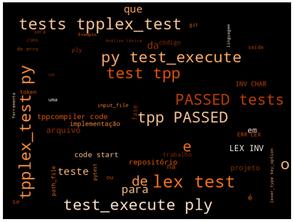

## Projeto de Implementação de um Compilador para a Linguagem **TPP**
### Análise Léxica (Trabalho -- 1a. parte)

#### Prof. Rogério Aparecido Gonçalves

### __Resumo:__ Este documento apresenta a especificação da 1a. parte do trabalho de implementação da disciplina. O objetivo nessa etapa é projetar e implementar a a fase de *Análise Léxica* do compilador para a linguagem **TPP**. A Análise Léxica é a fase do compilador que lê o _código-fonte_ do arquivo de entrada como um fluxo de caracteres, e nesse processo de varredura reconhece os _tokens_ ou marcas da linguagem. Um repositório template foi preparado para que os alunos obtenham o código inicial da implementação dessa fase e o mesmo repositório será utilizado para as implementações das demais fases do projeto. São fornecidos testes automatizados para serem executados com o _pytest_ e modelo para o relatório de implementação do projeto.
  
# Análise Léxica

A __Análise Léxica__ é a fase do compilador que lê o _código-fonte_ do arquivo de entrada como um fluxo de caracteres, e nesse processo de varredura reconhece os _tokens_ ou marcas da linguagem. As denominações Sistema de Varredura, Analisador Léxico e _Scanner_ são equivalentes.

Devem ser reconhecidas as marcas presentes na linguagem `TPP`, como `se`, `repita` e outras que são palavras chave, palavras reservadas. Precisam ser reconhecidos os nomes de variáveis e funções que são os identificadores, símbolos e operadores aritméticos, lógicos e relacionais.

O processo de reconhecimento das marcas, a identificação de padrões pode ser feito de duas formas: utilizando-se _expressões regulares_ ou implementando o analisador com _autômatos finitos_.

Para implementar o sistema de varredura _(scanner)_ para a linguagem `TPP`, é necessário tomar nota das classes de **tokens** apresentadas na @tbl:tpp:tokens. 

| **palavras reservadas** | **símbolos**    |
| ----------------------- | ------------    |
| `se`                    | + soma          |
| `então`                 | - subtração     |
| `senão`                 | * multiplicação |
| `fim`                   | / divisão       |
| `repita`                | = igualdade     |
| `flutuante`             | , vírgula       |
| `retorna`               | := atribuição   |
| `até`                   | < menor         |
| `leia`                  | > maior         |
| `escreva`               | <= menor-igual  |
| `inteiro`               | >= maior-igual  |
|                         | ( abre-par      |
|                         | ( fecha-par     |
|                         | : dois-pontos   |
|                         | [ abre-col      |
|                         | ] fecha-col     |
|                         | && e-logico     |
|                         | \|\| ou-logico  |
|                         | ! negação       |

: **Tokens** da linguagem **TPP** {#tbl:tpp:tokens}


Ainda podem ser definidos os `tokens` seguintes:

- **número**: 1 ou mais dígitos que podem ser *inteiro* ou *flutuante* (representação em notação científica ou não);
- **identificador**: começa com uma letra e precede com $N$ letras e números sem limite de tamanho;
- **comentários**: cercados de chaves da seguinte forma: `{...}`. É possível inclusive comentários que cubram múltiplas linhas. Comentários devem ser ignorados no processo de reconhecimento.

Os `tokens` estão definidos na [Gramática da Linguagem](https://docs.google.com/document/d/1e7_M-bD1RUbJAnyR8rZyJ35vKbYEN6KQG4l5L8FQ7_I/edit?usp=sharing)[^3], e são listados no @lst:tokens.


```{#lst:tokens .ebnf caption="Tokens da Linguagem"}
MAIS, MENOS, VEZES, DIVIDE, DOIS_PONTOS, VIRGULA, MENOR, MAIOR, IGUAL, DIFERENTE, 
MENOR_IGUAL, MAIOR_IGUAL, E, OU, NAO, ABRE_PARENTESE, FECHA_PARENTESE, 
ABRE_COLCHETE, FECHA_COLCHETE, SE, ENTAO, SENAO, FIM, REPITA, ATE, ATRIBUICAO, 
LEIA, ESCREVA, RETORNA, INTEIRO, FLUTUANTE, NUM_INTEIRO, NUM_PONTO_FLUTUANTE, 
NUM_NOTACAO_CIENTIFICA, ID
```
[^3]:[Gramática da Linguagem](https://docs.google.com/document/d/1e7_M-bD1RUbJAnyR8rZyJ35vKbYEN6KQG4l5L8FQ7_I/edit?usp=sharing)

**Obs.:** As palavras reservadas são em português brasileiro como indicado na tabela, com acentuação.

O código base para a implementação está disponível no link [Link para o Código de Start no Github Classroom](https://moodle.utfpr.edu.br/mod/url/view.php?id=1733830) do Moodle.

## Instruções Gerais

1. Acesse o repositório de [Código de Start](https://moodle.utfpr.edu.br/mod/url/view.php?id=1733830) e clique no botão `[Use this Template]` ou vá diretamente no link <https://github.com/rogerioag/tppcompiler-code-start/generate>. O aluno clica em **"Use this template"** $\rightarrow$ **"Create a new repository"**, coloque o nome no seu repositório de `tppcompiler-<seulogin-github>` e crie seu repositório como **Privado**.

Após essa configuração inicial criando o repositório do teu projeto a partir do _template_ você deve clonar localmente para tua máquina e adicionar o repositório do professor como _upstream_. Esse configuração deve ser feita apenas uma vez, conforme o @lst:comandos:iniciais.


```{#lst:comandos:iniciais .bash caption="Comandos de configuração do repositório"}
# Clonar o próprio repositório.
git clone https://github.com/<seulogin-github>/tppcompiler-<seulogin-github>.git
cd tppcompiler-<seulogin-github>

# Conectar o repositório oficial do professor como 'upstream'.
git remote add upstream https://github.com/rogerioag/tppcompiler-code-start.git

# Verificar se os remotes estão corretos
git remote -v
# origin   -> https://github.com/aluno/tppcompiler.git (fetch e push)
# upstream -> https://github.com/rogerioag/tppcompiler-code-start.git (fetch)
```

2. Siga a estrutura fornecida para desenvolver o trabalho, pois será a mesma estrutura que deverá ser entregue ao final do projeto. Nas outras fases iremos adicionar outras partes do projeto nesse repositório.

Você desenvolverá a primeira fase do trabalho no diretório: `src/tpplexer/`, e rodará os testes locais com `pytest tests/tpplex_test.py`. Ao terminar a implementação envie para o seu `github`, conforme o @lst:comandos:envio.

```{#lst:comandos:envio .bash caption="Comandos de envio para o github"}
git add .
git commit -m "feat: Implementação da Análise Léxica"
git push origin main
```

3. Após o envio para o seu `github`, acesse o link <https://github.com/<seulogin-github/tppcompiler-seulogin-github/actions> e verifique o resultado da execução dos testes. Se algum teste falhar, corrija o problema e repita o processo.

4. Prepare o relatório com a descrição do trabalho e da implementação e exemplos de entrada e saída gerada pelo Analisador Léxico, conforme a [Seção @sec:tpp:doc:lex].

5. Deverá ser entregue o repositório compactado via moodle, conforme descrito na [Seção @sec:tpp:doc:entrega]. Com o código fonte da implementação completa e o relatório em **pdf** no formato de artigo conforme o modelo descrito na [Seção @sec:tpp:doc:entrega].

6. O projeto deve seguir a estrutura de diretórios e arquivos, disponível no repositório.

## Linguagens de Programação para a Implementação

Para a implementação do compilador, pode ser utilizado qualquer linguagem de programação[^1]. É recomendado que seja utilizado uma linguagem que dê suporte à estruturas de dados de alto nível e preferencialmente que exista bibliotecas para a construção da varredura e gramática. Algumas LPs/ferramentas conhecidas são:

[^1]: Que tenha suporte às ferramentas de especificação do sistema de varredura e da gramática e que também tenha suporte ao [LLVM](http://llvm.org).

* `C/C++ - Flex/Bison` [@paxson1995flex], [@bison]
* `Python - PLY` (que possui ferramenta Léxica e Sintática) [@ply]
* `Java - JFlex/Jacc` [@jflex2020], [@jacc]

**Obs.:** A implementação de referência será apresentada na linguagem `Python`.

Para essa fase serão necessárias as instalações das bibliotecas do `Python`:

* `PLY`: <https://pypi.org/project/ply/>

Um arquivo `requirements.txt` está disponível no projeto com outras bibliotecas necessárias para as próximas fases.

## Testes {#sec:tpp:test:lex}

Alguns casos de testes estão disponíveis no repositório do projeto. Como o `Github Classroom` foi descontinuado, iremos executar os testes com o `pytest` local e no próprio `github`. Serão executados esses testes e outros testes que o professor julgar necessário durante a avaliação desta parte do trabalho.

* __Varredura:__ programa de exemplo `TPP` de **entrada** na linha de comando. 
* **Saída** será uma lista de _tokens_.

No [Código de Start](https://moodle.utfpr.edu.br/mod/url/view.php?id=1733830) tem um diretório com os testes para a Análise Léxica em `tests/lex-tests`.

É necessário terminar o desenvolvimento da parte de tratamento de erros. Está sendo disponibilizado uma classe de tratamento de erros que será utilizada em todas as fases do projeto, a `src/myerror.py` que carrega uma lista de erros _globais_ e de cada módulo lendo os arquivos:

```text
 GlobalErrorMessages.properties
 tpplexer/LexerErrorMessages.properties
 tppparser/ ParserErrorMessages.properties
 tppsema/SemaErrorMessages.properties
 tppcodegen/CodeGenErrorMessages.properties
```

 A lista é composta por pares (chave=valor) formada por _códigos de erros_ e as _mensagens de erros_ correspondentes.

 Erros gerais da ferramenta de compilação:

```txt
[GlobalErrors]
ERR-GLOB-USE=Uso: python tpplex.py file.tpp
ERR-GLOB-NOT-TPP=Não é um arquivo .tpp.
ERR-GLOB-FILE-NOT-EXISTS=Arquivo .tpp não existe.
```

Erros específicos do analisar léxico:

```txt
[LexerErrors]
ERR-LEX-USE=Uso: python tpplex.py file.tpp
ERR-LEX-NOT-TPP=Não é um arquivo .tpp.
ERR-LEX-FILE-NOT-EXISTS=Arquivo .tpp não existe.
ERR-LEX-INV-CHAR=Caracter inválido.
ERR-LEX-UNC-COMMENT=Comentário não fechado.
```

Para que os testes possam ser automatizados foi disponibilizado um arquivo padrão que contém um conjunto de testes para a análise léxica (arquivo `tests/tpplex_test.py`). O `Github` executa os testes a cada `commit` feito pelo dono do repositório. O sistema executa o `tests/tpplex.py` da sua implementação com cada um dos $42$ arquivos de testes e comparava se a saída produzida é a mesma que a saída esperada.

```python
import pytest
import subprocess
import shlex
import os, fnmatch

# Testes para se passar um arquivo em branco, um arquivo com outra extensão e 
# um arquivo .tpp que não existe.
test_cases = [("ply", "-k", ""), ("ply", "-k", "teste.c"), ("ply", "-k", 
"notexist.tpp")]

files = fnmatch.filter(os.listdir('tests/lex-tests/'), '*.tpp')
for file in sorted(files):
    test_cases.append(("ply", "-k", file))
    

@pytest.mark.parametrize("lexer_type, key_option, input_file", test_cases)
def test_execute(lexer_type, key_option, input_file):
    if(input_file != ''):
        path_file = 'tests/lex-tests/' + input_file
    else:
        path_file = ""
    
    # Executa o comando de compilação.
    cmd = "python src/tpp_compiler.py --lexer {0} {1} {2}".format(lexer_type, 
    key_option, path_file)

    process = subprocess.Popen(shlex.split(cmd), stdout=subprocess.PIPE, 
    stderr=subprocess.PIPE)
    
    stdout, stderr = process.communicate()
    stdout, stderr

    path_file = 'tests/lex-tests/' + input_file
    output_file = open(path_file + ".lex.out", "r")

    #read whole file to a string
    expected_output = output_file.read()

    output_file.close()

    print("Generated output:")
    print(stdout)
    print("Expected output:")
    print(expected_output)

    assert stdout.decode("utf-8").strip() == expected_output.strip()
```

Os testes podem ser executados localmente utilizando o [`pytest`](https://docs.pytest.org), se os testes não estiverem corretos com a saída esperada, mensagens de erros serão apresentadas. No modo padrão quando executar o `pytest` ele encontrará todos os arquivos de testes existentes dentro do diretório `tests` e executará cada um deles.

```bash
[tppcompiler-code-start]$ pytest 
============================== test session starts ==============================
platform linux -- Python 3.14.7, pytest-9.1.1, pluggy-1.6.0
rootdir: tppcompiler-code-start
plugins: anyio-4.13.0
collected 42 items                                                                                                                              

tests/tpplex_test.py .........................................                                                           [100%]

=================================== FAILURES ====================================
____________________ test_execute[ply--k-lex-test-001.tpp] ____________________

lexer_type = 'ply', key_option = '-k', input_file = 'lex-test-001.tpp'

    @pytest.mark.parametrize("lexer_type, key_option, input_file", test_cases)
    def test_execute(lexer_type, key_option, input_file):
        if(input_file != ''):
            path_file = 'tests/lex-tests/' + input_file
        else:
            path_file = ""
    
        # Executa o comando de compilação.
        cmd = "python src/tpp_compiler.py --lexer {0} {1} {2}".
        format(lexer_type, key_option, path_file)
    
        process = subprocess.Popen(shlex.split(cmd), stdout=subprocess.PIPE, 
        stderr=subprocess.PIPE)
    
        stdout, stderr = process.communicate()
        stdout, stderr
    
        path_file = 'tests/lex-tests/' + input_file
        output_file = open(path_file + ".lex.out", "r")
    
        #read whole file to a string
        expected_output = output_file.read()
    
        output_file.close()
    
        print("Generated output:")
        print(stdout)
        print("Expected output:")
        print(expected_output)
    
>       assert stdout.decode("utf-8").strip() == expected_output.strip()
E       AssertionError: assert 'INTEIRO\nDOI...-LEX-INV-CHAR' == 'INTEIRO\nDOI...
-LEX-INV-CHAR'
E         
E         Skipping 39 identical leading characters in diff, use -v to show
E         - EX-INV-CHAR
E         + EX-INV-CHAR
E         ?            +
E         + ERR-LEX-INV-CHAR

tests/tpplex_test.py:83: AssertionError
---------------------------- Captured stdout call -------------------------------
Generated output:
b'INTEIRO\nDOIS_PONTOS\nID\nVIRGULA\nID\nERR-LEX-INV-CHAR\nERR-LEX-INV-CHAR\n'
Expected output:
INTEIRO
DOIS_PONTOS
ID
VIRGULA
ID
ERR-LEX-INV-CHAR

=========================== short test summary info ===========================
FAILED tests/tpplex_test.py::test_execute[ply--k-lex-test-001.tpp] - 
AssertionError: assert 'INTEIRO\nDOI...-LEX-INV-CHAR' == 'INTEIRO\nDOI...
-LEX-INV-CHAR'
====================== 1 failed, 41 passed in 3.08s ===========================
[tppcompiler-code-start]$ 
```

Para facilitar a visualização de qual dos testes falharam ou se todos passaram a opção `-v` pode ser utilizada e qual `suite` de testes queremos que seja executada. Se queremos nessa fase executar os testes da parte léxica, então o caminho do arquivo de testes será `tests/tpplex_test.py`, conforme apresentado no exemplo abaixo:

```bash
[tppcompiler-code-start]$ pytest tests/tpplex_test.py -v
============================== test session starts ==============================
platform linux -- Python 3.14.7, pytest-9.1.1, pluggy-1.6.0 -- /usr/bin/python
cachedir: .pytest_cache
rootdir: tppcompiler-code-start
plugins: anyio-4.13.0
collected 42 items                                                                                                                              

tests/tpplex_test.py::test_execute[ply--k-] PASSED                          [  2%]
tests/tpplex_test.py::test_execute[ply--k-teste.c] PASSED                   [  4%]
tests/tpplex_test.py::test_execute[ply--k-notexist.tpp] PASSED              [  7%]
tests/tpplex_test.py::test_execute[ply--k-lex-test-001.tpp] FAILED          [  9%]
tests/tpplex_test.py::test_execute[ply--k-lex-test-002.tpp] PASSED          [ 11%]
tests/tpplex_test.py::test_execute[ply--k-lex-test-003.tpp] PASSED          [ 14%]
tests/tpplex_test.py::test_execute[ply--k-lex-test-004.tpp] PASSED          [ 16%]
tests/tpplex_test.py::test_execute[ply--k-lex-test-005.tpp] PASSED          [ 19%]
tests/tpplex_test.py::test_execute[ply--k-lex-test-006.tpp] PASSED          [ 21%]
tests/tpplex_test.py::test_execute[ply--k-lex-test-007.tpp] PASSED          [ 23%]
tests/tpplex_test.py::test_execute[ply--k-lex-test-008.tpp] PASSED          [ 26%]
tests/tpplex_test.py::test_execute[ply--k-lex-test-009.tpp] PASSED          [ 28%]
tests/tpplex_test.py::test_execute[ply--k-lex-test-010.tpp] PASSED          [ 30%]
tests/tpplex_test.py::test_execute[ply--k-lex-test-011.tpp] PASSED          [ 33%]
tests/tpplex_test.py::test_execute[ply--k-lex-test-012.tpp] PASSED          [ 35%]
tests/tpplex_test.py::test_execute[ply--k-lex-test-013.tpp] PASSED          [ 38%]
tests/tpplex_test.py::test_execute[ply--k-lex-test-014.tpp] PASSED          [ 40%]
tests/tpplex_test.py::test_execute[ply--k-lex-test-015.tpp] PASSED          [ 42%]
tests/tpplex_test.py::test_execute[ply--k-lex-test-016.tpp] PASSED          [ 45%]
tests/tpplex_test.py::test_execute[ply--k-lex-test-017.tpp] PASSED          [ 47%]
tests/tpplex_test.py::test_execute[ply--k-lex-test-018.tpp] PASSED          [ 50%]
tests/tpplex_test.py::test_execute[ply--k-lex-test-019.tpp] PASSED          [ 52%]
tests/tpplex_test.py::test_execute[ply--k-lex-test-020.tpp] PASSED          [ 54%]
tests/tpplex_test.py::test_execute[ply--k-lex-test-021.tpp] PASSED          [ 57%]
tests/tpplex_test.py::test_execute[ply--k-lex-test-022.tpp] PASSED          [ 59%]
tests/tpplex_test.py::test_execute[ply--k-lex-test-023.tpp] PASSED          [ 61%]
tests/tpplex_test.py::test_execute[ply--k-lex-test-024.tpp] PASSED          [ 64%]
tests/tpplex_test.py::test_execute[ply--k-lex-test-025.tpp] PASSED          [ 66%]
tests/tpplex_test.py::test_execute[ply--k-lex-test-026.tpp] PASSED          [ 69%]
tests/tpplex_test.py::test_execute[ply--k-lex-test-027.tpp] PASSED          [ 71%]
tests/tpplex_test.py::test_execute[ply--k-lex-test-028.tpp] PASSED          [ 73%]
tests/tpplex_test.py::test_execute[ply--k-lex-test-029.tpp] PASSED          [ 76%]
tests/tpplex_test.py::test_execute[ply--k-lex-test-030.tpp] PASSED          [ 78%]
tests/tpplex_test.py::test_execute[ply--k-lex-test-031.tpp] PASSED          [ 80%]
tests/tpplex_test.py::test_execute[ply--k-lex-test-032.tpp] PASSED          [ 83%]
tests/tpplex_test.py::test_execute[ply--k-lex-test-033.tpp] PASSED          [ 85%]
tests/tpplex_test.py::test_execute[ply--k-lex-test-034.tpp] PASSED          [ 88%]
tests/tpplex_test.py::test_execute[ply--k-lex-test-035.tpp] PASSED          [ 90%]
tests/tpplex_test.py::test_execute[ply--k-lex-test-036.tpp] PASSED          [ 92%]
tests/tpplex_test.py::test_execute[ply--k-lex-test-037.tpp] PASSED          [ 95%]
tests/tpplex_test.py::test_execute[ply--k-lex-test-038.tpp] PASSED          [ 97%]
tests/tpplex_test.py::test_execute[ply--k-lex-test-039.tpp] PASSED         [100%]

================================== FAILURES =====================================
______________________ test_execute[ply--k-lex-test-001.tpp] ____________________

lexer_type = 'ply', key_option = '-k', input_file = 'lex-test-001.tpp'

    @pytest.mark.parametrize("lexer_type, key_option, input_file", test_cases)
    def test_execute(lexer_type, key_option, input_file):
        if(input_file != ''):
            path_file = 'tests/lex-tests/' + input_file
        else:
            path_file = ""
    
        # Executa o comando de compilação.
        cmd = "python src/tpp_compiler.py --lexer {0} {1} {2}".
        format(lexer_type, key_option, path_file)
    
        process = subprocess.Popen(shlex.split(cmd), stdout=subprocess.PIPE, 
        stderr=subprocess.PIPE)
    
        stdout, stderr = process.communicate()
        stdout, stderr
    
        path_file = 'tests/lex-tests/' + input_file
        output_file = open(path_file + ".lex.out", "r")
    
        #read whole file to a string
        expected_output = output_file.read()
    
        output_file.close()
    
        print("Generated output:")
        print(stdout)
        print("Expected output:")
        print(expected_output)
    
>       assert stdout.decode("utf-8").strip() == expected_output.strip()
E       AssertionError: assert 'INTEIRO\nDOI...-LEX-INV-CHAR' == 'INTEIRO\nDOI...
-LEX-INV-CHAR'
E         
E           INTEIRO
E           DOIS_PONTOS
E           ID
E           VIRGULA
E           ID
E         + ERR-LEX-INV-CHAR
E           ERR-LEX-INV-CHAR

tests/tpplex_test.py:83: AssertionError
------------------ Captured stdout call ---------------------
Generated output:
b'INTEIRO\nDOIS_PONTOS\nID\nVIRGULA\nID\nERR-LEX-INV-CHAR\nERR-LEX-INV-CHAR\n'
Expected output:
INTEIRO
DOIS_PONTOS
ID
VIRGULA
ID
ERR-LEX-INV-CHAR

============================ short test summary info ============================
FAILED tests/tpplex_test.py::test_execute[ply--k-lex-test-001.tpp] - 
AssertionError: assert 'INTEIRO\nDOI...-LEX-INV-CHAR' == 'INTEIRO\nDOI...
-LEX-INV-CHAR'
============================== 1 failed, 41 passed in 3.08s =====================
[tppcompiler-code-start]$ 

```

Se a saída gerada pela sua implementação estiver correta conforme a saída esperada, nenhuma mensagem de erro será apresentada e o `pytest` indicará que todos os testes passaram.

```bash
[tppcompiler-code-start]$ pytest tests/tpplex_test.py -v
========================= test session starts ==========================
platform linux -- Python 3.14.7, pytest-9.1.1, pluggy-1.6.0 -- /usr/bin/python
cachedir: .pytest_cache
rootdir: tppcompiler-code-start
plugins: anyio-4.13.0
collected 42 items                                                                                                                              

tests/tpplex_test.py::test_execute[ply--k-] PASSED                          [  2%]
tests/tpplex_test.py::test_execute[ply--k-teste.c] PASSED                   [  4%]
tests/tpplex_test.py::test_execute[ply--k-notexist.tpp] PASSED              [  7%]
tests/tpplex_test.py::test_execute[ply--k-lex-test-001.tpp] PASSED          [  9%]
tests/tpplex_test.py::test_execute[ply--k-lex-test-002.tpp] PASSED          [ 11%]
tests/tpplex_test.py::test_execute[ply--k-lex-test-003.tpp] PASSED          [ 14%]
tests/tpplex_test.py::test_execute[ply--k-lex-test-004.tpp] PASSED          [ 16%]
tests/tpplex_test.py::test_execute[ply--k-lex-test-005.tpp] PASSED          [ 19%]
tests/tpplex_test.py::test_execute[ply--k-lex-test-006.tpp] PASSED          [ 21%]
tests/tpplex_test.py::test_execute[ply--k-lex-test-007.tpp] PASSED          [ 23%]
tests/tpplex_test.py::test_execute[ply--k-lex-test-008.tpp] PASSED          [ 26%]
tests/tpplex_test.py::test_execute[ply--k-lex-test-009.tpp] PASSED          [ 28%]
tests/tpplex_test.py::test_execute[ply--k-lex-test-010.tpp] PASSED          [ 30%]
tests/tpplex_test.py::test_execute[ply--k-lex-test-011.tpp] PASSED          [ 33%]
tests/tpplex_test.py::test_execute[ply--k-lex-test-012.tpp] PASSED          [ 35%]
tests/tpplex_test.py::test_execute[ply--k-lex-test-013.tpp] PASSED          [ 38%]
tests/tpplex_test.py::test_execute[ply--k-lex-test-014.tpp] PASSED          [ 40%]
tests/tpplex_test.py::test_execute[ply--k-lex-test-015.tpp] PASSED          [ 42%]
tests/tpplex_test.py::test_execute[ply--k-lex-test-016.tpp] PASSED          [ 45%]
tests/tpplex_test.py::test_execute[ply--k-lex-test-017.tpp] PASSED          [ 47%]
tests/tpplex_test.py::test_execute[ply--k-lex-test-018.tpp] PASSED          [ 50%]
tests/tpplex_test.py::test_execute[ply--k-lex-test-019.tpp] PASSED          [ 52%]
tests/tpplex_test.py::test_execute[ply--k-lex-test-020.tpp] PASSED          [ 54%]
tests/tpplex_test.py::test_execute[ply--k-lex-test-021.tpp] PASSED          [ 57%]
tests/tpplex_test.py::test_execute[ply--k-lex-test-022.tpp] PASSED          [ 59%]
tests/tpplex_test.py::test_execute[ply--k-lex-test-023.tpp] PASSED          [ 61%]
tests/tpplex_test.py::test_execute[ply--k-lex-test-024.tpp] PASSED          [ 64%]
tests/tpplex_test.py::test_execute[ply--k-lex-test-025.tpp] PASSED          [ 66%]
tests/tpplex_test.py::test_execute[ply--k-lex-test-026.tpp] PASSED          [ 69%]
tests/tpplex_test.py::test_execute[ply--k-lex-test-027.tpp] PASSED          [ 71%]
tests/tpplex_test.py::test_execute[ply--k-lex-test-028.tpp] PASSED          [ 73%]
tests/tpplex_test.py::test_execute[ply--k-lex-test-029.tpp] PASSED          [ 76%]
tests/tpplex_test.py::test_execute[ply--k-lex-test-030.tpp] PASSED          [ 78%]
tests/tpplex_test.py::test_execute[ply--k-lex-test-031.tpp] PASSED          [ 80%]
tests/tpplex_test.py::test_execute[ply--k-lex-test-032.tpp] PASSED          [ 83%]
tests/tpplex_test.py::test_execute[ply--k-lex-test-033.tpp] PASSED          [ 85%]
tests/tpplex_test.py::test_execute[ply--k-lex-test-034.tpp] PASSED          [ 88%]
tests/tpplex_test.py::test_execute[ply--k-lex-test-035.tpp] PASSED          [ 90%]
tests/tpplex_test.py::test_execute[ply--k-lex-test-036.tpp] PASSED          [ 92%]
tests/tpplex_test.py::test_execute[ply--k-lex-test-037.tpp] PASSED          [ 95%]
tests/tpplex_test.py::test_execute[ply--k-lex-test-038.tpp] PASSED          [ 97%]
tests/tpplex_test.py::test_execute[ply--k-lex-test-039.tpp] PASSED          [100%]

======================================= 42 passed in 2.96s =======================
[tppcompiler-code-start]$ 

```

A ideia é que em uma _execução normal_ as mensagens de erros sejam recuperadas e impressas na saída padrão (terminal). 

Exemplo de saída para teste sem erros em _execução normal_.

```bash
[tppcompiler-code-start]$ python src/tpp_compiler.py --lexer ply \ 
tests/lex-tests/lex-test-001.tpp
```

Arquivo: `tests/lex-tests/lex-test-001.tpp`.

[columns]

[column=0.5]

__Entrada:__

```txt
inteiro: a,b
```

[column=0.5]

__Saída gerada:__

```txt
INTEIRO
DOIS_PONTOS
ID
VIRGULA
ID
```

[/columns]


Exemplo de saída para teste com erro em _execução normal_.

```bash
[tppcompiler-code-start]$ python src/tpp_compiler.py --lexer ply \ 
    tests/lex-tests/lex-test-002.tpp
```

Arquivo: `tests/lex-tests/lex-test-002.tpp`

[columns]

[column=0.5]

__Entrada:__

```txt
inteiro: a,b
ç
```

[column=0.5]

__Saída gerada:__

```txt
INTEIRO
DOIS_PONTOS
ID
VIRGULA
ID
Erro[2][1]: Caracter inválido. valor: ç
```

[/columns]

Já em uma _execução de testes automatizados_ seja fornecido um parâmetro `-k` que imprima o código de erro apenas, possibilitando que o código apareça entre os _tokens_ da lista de _tokens_ gerada para o arquivo de entrada.

Exemplo de saída para teste sem erros em _execução de testes automatizados_ não é alterada.

```bash
[tppcompiler-code-start]$ python src/tpp_compiler.py --lexer ply -k \ 
    tests/lex-tests/lex-test-001.tpp
```

Arquivo: `tests/lex-tests/lex-test-001.tpp`

[columns]

[column=0.5]

__Entrada:__

```txt
inteiro: a,b
```

[column=0.5]

__Saída gerada:__

```txt
INTEIRO
DOIS_PONTOS
ID
VIRGULA
ID
```

[/columns]

Exemplo de saída para teste com erros em _execução de testes automatizados_.

```bash
[tppcompiler-code-start]$ python src/tpp_compiler.py --lexer ply -k \ 
    tests/lex-tests/lex-test-002.tpp
```

Arquivo: `tests/lex-tests/lex-test-002.tpp`

[columns]

[column=0.5]

__Entrada:__

```txt
inteiro: a,b
ç
```

[column=0.5]

__Saída gerada:__

```txt
INTEIRO
DOIS_PONTOS
ID
VIRGULA
ID
ERR-LEX-INV-CHAR
```
[/columns]

Note que a opção `-k` foi introduzida e a chave `ERR-LEX-INV-CHAR` foi impressa no lugar da mensagem de erro, facilitando a verificação automatizada do código, sem a preocupação sobre o formato da mensagem de erro que desenvolvedor colocou.

## Relatório e Documentação {#sec:tpp:doc:lex}

Durante toda a disciplina o aluno criará uma documentação formal da implementação do compilador para a linguagem. Sendo o relatório com conteúdo acumulativo, isto é, as fases subsequentes irão complementar o conteúdo existente das fases anteriores. 

Para a fase de __Análise Léxica__, a documentação deve apresentar:

* Especificação da linguagem de programação `TPP`;
* Especificação formal dos autômatos para a formação de cada classe de **token** da linguagem;
* Detalhes da implementação da varredura na `LP` e ferramenta (e/ou bibliotecas) escolhidas pelo projetista;
* Exemplos de saída do sistema de varredura (lista de *tokens*) para exemplos de entrada (código fonte).
* Implemente uma função que imprima a lista de **tokens**, não utilize a saída padrão da ferramenta de implementação de **Analisadores Léxicos**.

O relatório deve ser escrito no formato de artigo[^2] disponível no [link](https://www.overleaf.com/read/fcqmjkfgktgt), faça uma cópia para seu `Overleaf`. O número mínimo em cada etapa é de $12$ páginas.

[^2]: [Formato para o relatório: https://www.overleaf.com/read/fcqmjkfgktgt](https://www.overleaf.com/read/fcqmjkfgktgt)

## Avaliação

Será avaliado o funcionamento da varredura para a linguagem de programação `TPP`. Para a avaliação inicial será considerado então (obrigatoriamente):

* Utilizar palavras reservadas em português (pt-BR);
* Construção da Análise Léxica;
* Inserção de comentários (para adicionar explicações futuras no código);
* Levantamento de erros (sugerindo classes de erros). Para isso: Contabilizar linhas (`\n`), colunas e lexema atual (as ferramentas fazem isso);

* Serão avaliados, dentre outros critérios:
  a) __Da implementação:__
    * O funcionamento do programa.
    * O capricho e a organização na elaboração do projeto.
    * A corretude da implementação em relação ao que foi pedido no trabalho.
    * A colocação em prática dos conceitos que foram discutidos em sala de aula de forma correta.
    * A qualidade do projeto e da implementação (descrição e elaboração do projeto e o passo a passo da implementação).

  b) __Do relatório:__
    * O conteúdo e a forma que foi apresentado, se o formato é o mesmo solicitado.
    * Organização das ideias e do processo de tradução.
    * O capricho na elaboração e na formatação do texto, bem como o conteúdo do texto.

* Não serão avaliados os trabalhos:
  a) Que chegarem fora do prazo.
  b) Que não forem feitos nas ferramentas solicitadas.
  c) Que não estão no formato especificado.
  d) Que não foram compactados em um só arquivo.
  e) Que não tiverem identificação (nome e matrícula).
  f) Que forem cópias de outros trabalhos ou materiais da internet.
  g) Que não seguirem todas estas instruções.

* Não se esqueça que o trabalho vale **10,0** e contribui para o cálculo da nota final.

## Entrega e Apresentação {#sec:tpp:doc:entrega}

O trabalho será **individual** e deverá ser entregue até o dia **06/10/2026** no moodle da disciplina em um pacote compactado. A estrutura do projeto (repositório) com os arquivos do projeto (fonte e relatório) deve ser compactada (zipados) e o arquivo compactado deve ser enviado pelo moodle utilizando a opção de submissão [__**"Trabalho 1a. parte - Análise Léxica"**__](https://moodle.utfpr.edu.br/mod/assign/view.php?id=1733835), o nome do arquivo compactado deve seguir o padrão `BCC__ILP_OPT011__P1__Testerson_dos_Santos__RA_ 123456.zip`.

**Obs.:** Favor utilizar ZIP como forma de compactação. O Relatório deve ser entregue impresso, no horário da aula, para o professor.

\newpage

## Leitura Recomendada {.allowframebreaks}
\normalsize

[alertblock]{Leitura Recomendada}

__Capítulo 2: Varredura__

**Livro**: [```LOUDEN, Kenneth C. Compiladores: principios e praticas. Sao Paulo, SP: Thomson, c2004. xiv, 569 p. ISBN 8522104220.```](https://integrada.minhabiblioteca.com.br/reader/books/9788522128532/pageid/95)

[/alertblock]

[exampleblock]{Leitura Recomendada}

__Capítulo 3: Análise Léxica__

**Livro**: [`AHO, Alfred V. et al. Compiladores: principios, tecnicas e ferramentas. 2. ed. Sao Paulo, SP: Pearson Addison-Wesley, 2008. x, 634 p. ISBN 9788588639249.`](https://integrada.minhabiblioteca.com.br/#/books/9788588639249/pageid/89)

[/exampleblock]

[block]{Leitura Recomendada}

__Capítulo 2: Scanners__

**Livro**: [`COOPER, Keith D.; TORCZON, Linda. Construindo compiladores. Rio de Janeiro, RJ: Elsevier/Campus, 2014. xxiv, 656 p. ISBN 9788535255645. Disponível em: https://research.ebsco.com/linkprocessor/plink?id=debd0a1f-ba89-3ee8-b0a1-2c929486cc51. Acesso em: 12 mar. 2024.`](https://integrada.minhabiblioteca.com.br/#/books/9781558606982/pageid/48)

[/block]

## _Word Cloud_

{ width=100% }

## Referências {.fragile .allowframebreaks}
